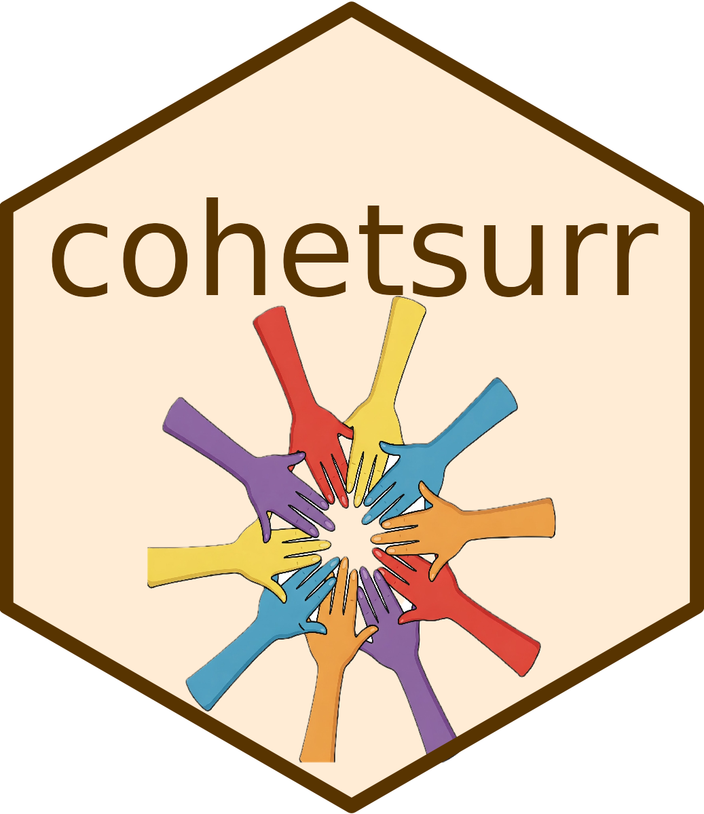

# cohetsurr 

<!-- badges: start -->

<!-- badges: end -->

`cohetsurr` is an `R` package to assess complex heterogeneity in the strength of a surrogate marker with respect to multiple baseline covariates, in either a randomized treatment setting or observational setting. For a randomized treatment setting, the functions assess and test for heterogeneity using both a parametric model and a semiparametric two-step model. For an observational setting, functions in this package assess complex heterogeneity in the strength of a surrogate marker using meta-learners, with options for different base learners.    

More details on the randomized setting method are available in Knowlton R, Tian L, & Parast L. (2025). A General Framework to Assess Complex Heterogeneity in the Strength of a Surrogate Marker. Statistics in Medicine, 44(5), e70001. [doi:10.1002/sim.70001](https://doi.org/10.1002/sim.70001). More details on the observational setting will be available in: Knowlton, R., Parast, L. (2025) "Assessing Surrogate Heterogeneity in Real World Data Using Meta-Learners."

Go here to view a tutorial for this package: [cohetsurr Tutorial](https://htmlpreview.github.io/?https://github.com/rebeccaknowlton/cohetsurr/blob/main/cohetsurr_tutorial.html). We also have a shiny app implementing these methods [here](https://parastlab.shinyapps.io/cohetsurrApp/).  

